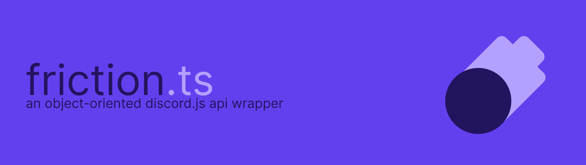

# Friction
Friction is an object-oriented Discord API wrapper built for ease of use.

### Documentation
Friction is documented through GitHub's wiki functionality, [you can find the documentation here](https://github.com/asciidude/friction.ts/wiki).